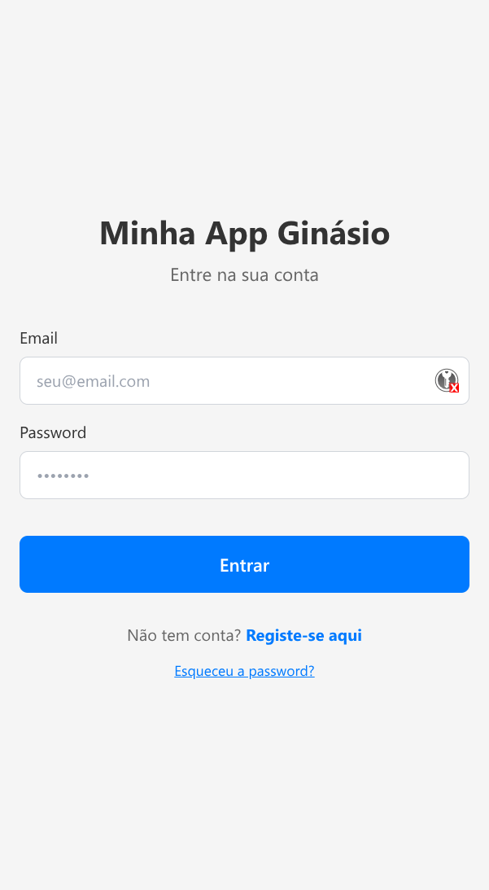
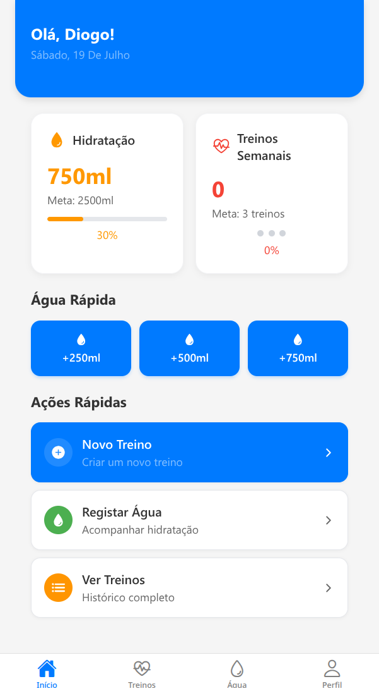
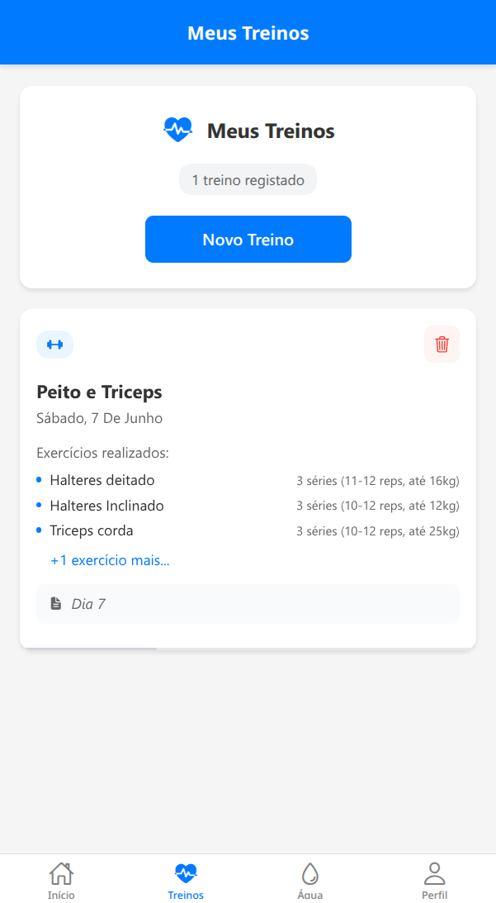
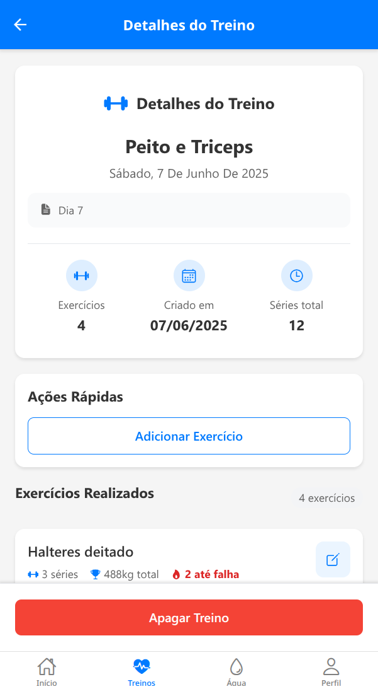
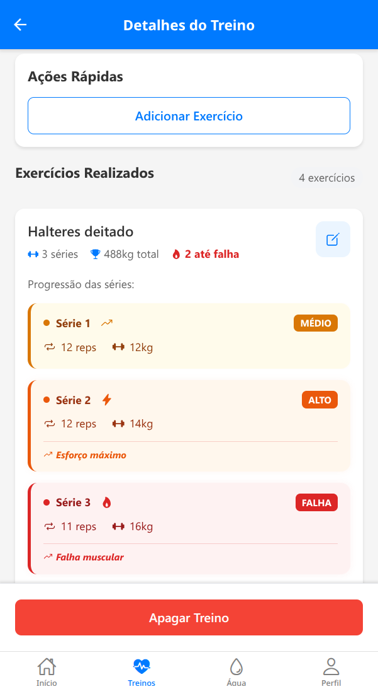
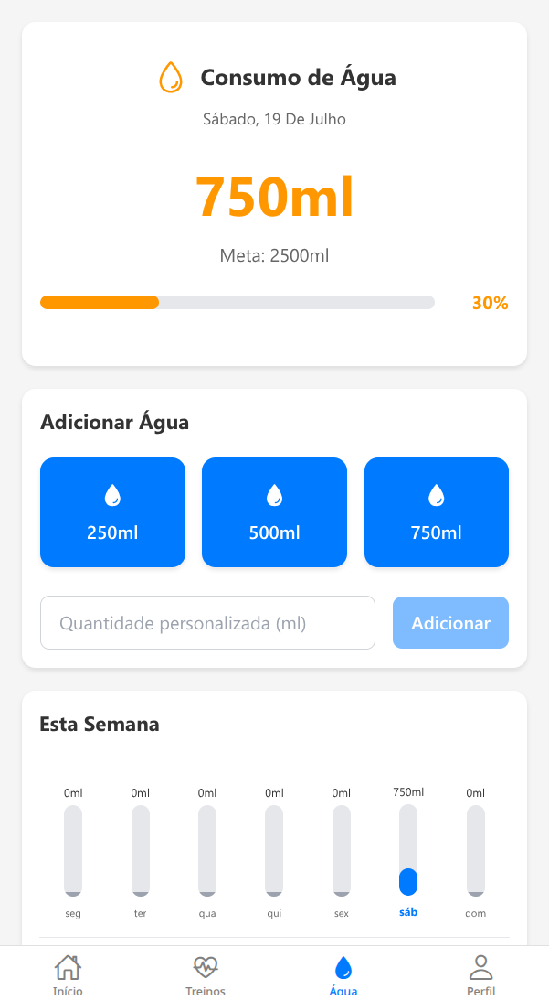

# MyGymApp - Personal Fitness Tracker

A comprehensive React Native mobile application for tracking workouts, water intake, and fitness goals. Built with Expo and Supabase for a seamless cross-platform experience.

## 🌟 Features

### 🏠 Login

Secure user authentication with email and password using Supabase Auth for user management.

<p align="left">
  
</p>

### 📊 Intelligent Dashboard

- Personalized greeting with current date
- Real-time progress tracking for hydration and workouts
- Quick stats overview showing completion percentages
- Fast action buttons for common tasks
- Clean, modern interface with intuitive navigation

<p align="left">
  
</p>

_Dashboard with quick stats and personalized greeting_

### 💪 Workout Management

- Create and customize workout routines with detailed exercise tracking
- Monitor sets, reps, and weights with visual progress indicators
- Track workout intensity levels (Low, Medium, High)
- Add exercise notes and track muscle fatigue
- Complete workout history with detailed analytics

<p align="left">
  
</p>

<p align="left">
  
  
</p>

### 💧 Smart Water Intake Tracking

- Set personalized daily water goals (customizable targets)
- Quick water logging with preset amounts (250ml, 500ml, 750ml)
- Custom amount input for precise tracking
- Visual progress bar showing daily completion percentage
- Weekly water consumption chart with day-by-day breakdown

<p align="left">
  
</p>

_Comprehensive water tracking with weekly analytics and quick-add buttons_

## 🚀 Getting Started

### Prerequisites

- Node.js (v16 or later)
- npm or yarn
- Expo CLI
- iOS Simulator or Android Emulator (optional)

### Installation

1. **Clone the repository**

   ```bash
   git clone https://github.com/your-username/MyGymApp.git
   cd MyGymApp/MinhaAppGinasio
   ```

2. **Install dependencies**

   ```bash
   npm install
   ```

3. **Set up environment variables**

   ```bash
   cp .env.example .env
   ```

   Fill in your Supabase credentials in the `.env` file.

4. **Start the development server**

   ```bash
   npx expo start
   ```

5. **Run on your device**
   - Download the [Expo Go](https://expo.dev/go) app
   - Scan the QR code from your terminal
   - Or run on simulator: `npx expo run:ios` / `npx expo run:android`

## 🏗️ Tech Stack

- **Frontend**: React Native with Expo
- **Backend**: Supabase (PostgreSQL)
- **Authentication**: Supabase Auth
- **Database**: PostgreSQL with real-time subscriptions
- **Storage**: Supabase Storage
- **Navigation**: React Navigation v6
- **State Management**: React Context + Hooks
- **Notifications**: Expo Notifications
- **Icons**: Expo Vector Icons
- **Styling**: StyleSheet with custom design system

## 📱 App Structure

```
MinhaAppGinasio/
├── components/           # Reusable UI components
│   ├── common/          # Generic components (Button, Input, Modal, Toast)
│   └── ...
├── screens/             # App screens
│   ├── auth/           # Authentication screens
│   ├── workouts/       # Workout-related screens
│   ├── profile/        # Profile and settings
│   └── ...
├── navigation/          # Navigation configuration
├── context/            # React Context providers
├── hooks/              # Custom React hooks
├── styles/             # Global styles and theme
├── utils/              # Utility functions and constants
└── lib/               # External service configurations
```

## 🎨 Design System

The app features a cohesive design system with:

- **Color Palette**: Primary, secondary, and semantic colors
- **Typography**: Consistent font sizes and weights
- **Spacing**: Standardized margins and padding
- **Components**: Reusable UI elements
- **Icons**: Comprehensive icon library
- **Animations**: Smooth transitions and feedback

## 🔐 Authentication & Security

- Secure user authentication with Supabase
- Password validation and strength requirements
- Email verification for new accounts
- Secure data transmission with HTTPS
- User data privacy and GDPR compliance

## 📊 Database Schema

### Users Table

- User profiles and preferences
- Workout and water goals
- Notification settings

### Workouts Table

- Workout sessions and metadata
- Exercise tracking and progression
- Notes and observations

### Water Intake Table

- Daily water consumption logs
- Goal tracking and achievements
- Historical data for analytics

## 🔔 Notifications

- **Water Reminders**: Customizable hydration alerts
- **Workout Reminders**: Scheduled training notifications
- **Supplement Tracking**: Creatine and custom reminders
- **Achievement Alerts**: Goal completion celebrations

## 📈 Analytics & Insights

- Personal fitness trends and patterns
- Weekly and monthly progress reports
- Goal achievement tracking
- Exportable data for external analysis

## 🛠️ Development

### Running Tests

```bash
npm test
```

### Building for Production

```bash
# iOS
npx eas build --platform ios

# Android
npx eas build --platform android

# Both platforms
npx eas build --platform all
```

### Code Style

The project uses ESLint and Prettier for code formatting:

```bash
npm run lint
npm run format
```

## 🤝 Contributing

We welcome contributions! Please follow these steps:

1. Fork the repository
2. Create a feature branch (`git checkout -b feature/amazing-feature`)
3. Commit your changes (`git commit -m 'Add amazing feature'`)
4. Push to the branch (`git push origin feature/amazing-feature`)
5. Open a Pull Request

### Development Guidelines

- Follow React Native best practices
- Write meaningful commit messages
- Add tests for new features
- Update documentation as needed
- Ensure code passes all linting checks

## 📋 Roadmap

### Upcoming Features

- [ ] Social features and workout sharing
- [ ] Integration with fitness wearables
- [ ] Nutrition tracking and meal planning
- [ ] AI implementation for personalized recommendations

### Version History

- **v1.0.0** - Beta release with core features

## 📱 Platform Support

- **iOS**: 13.0 and later
- **Android**: API level 21 (Android 5.0) and later
- **Web**: Modern browsers (Chrome, Safari, Firefox, Edge)

## 🐛 Known Issues

- Minor UI adjustments needed for iPad landscape mode
- Occasional sync delays with poor network connectivity
- Battery optimization on some Android devices may affect notifications

## 📄 License

This project is licensed under the MIT License - see the [LICENSE](LICENSE) file for details.

## 👥 Team

Just me, Diogo, the sole developer of MyGymApp. I handle everything from design to coding and testing.

## 🙏 Acknowledgments

- [Expo](https://expo.dev) for the amazing development platform
- [Supabase](https://supabase.com) for backend services
- [React Native](https://reactnative.dev) community for excellent documentation

---

**Download MyGymApp today and start your fitness journey!**

Soon available on the App Store and Google Play
